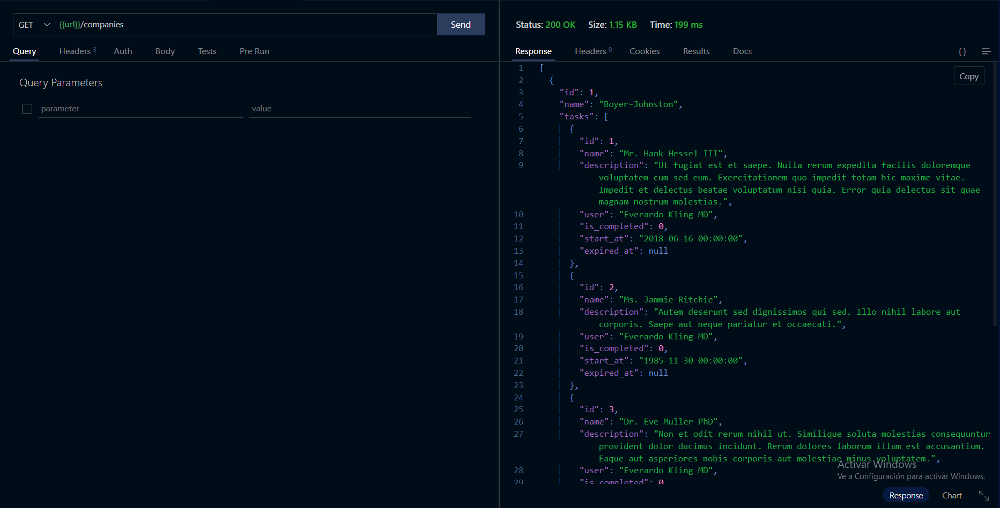
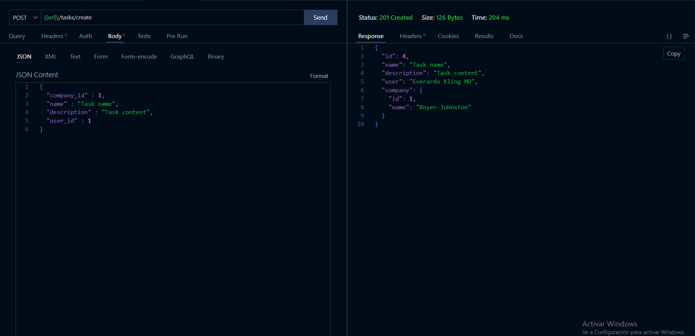
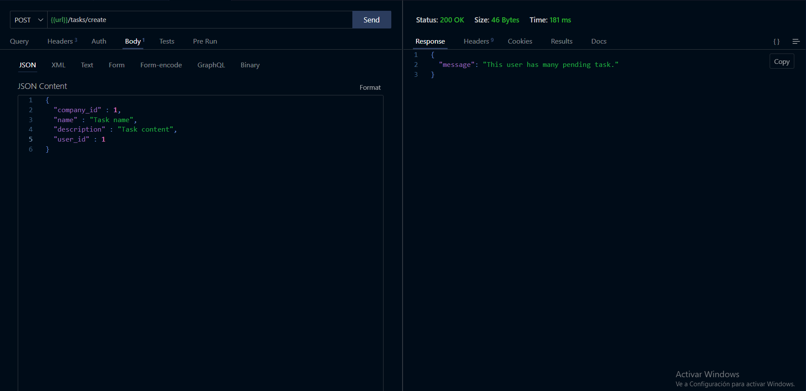
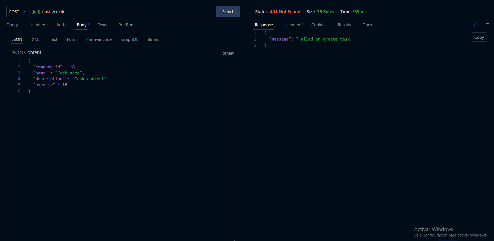
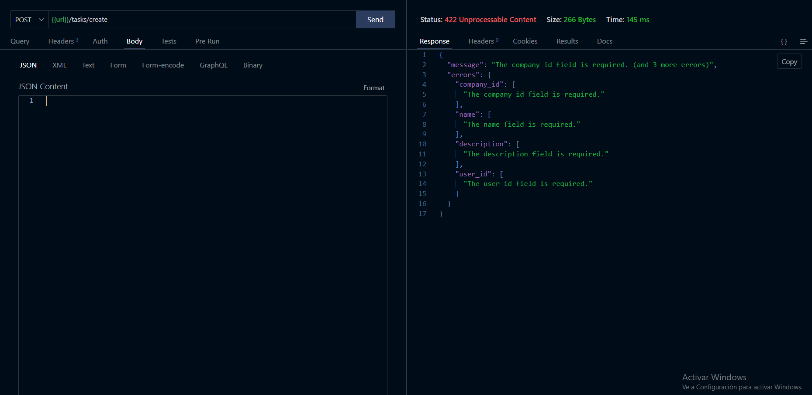

#Guillermo Arámbula Langarica

- [✅ Resultados obtenidos](#resultados-obtenidos "resultados-obtenidos")
- [🔗 Puntos de consulta](#puntos-de-consulta "resultados-obtenidos")
- [📷 Screenshots](#screenshots "resultados-obtenidos")

## Resultados obtenidos:
- [x] Se usó Laravel 10.x
- [x] Se puede consultar el listado de empresas y sus tareas relacionadas
- [x] Se implemento el uso de relaciones Eloquent HasMany
- [x] Se implemento el uso de relaciones Eloquent BelongsTo
- [x] Se utilizó validación para la creación de tareas
- [x] Se limito la creación de tareas pendientes a 5 por usuario
- [x] Los modelos están correctamente nombrados en base a las conveciones de Laravel
- [x] Las tablas de base de datos se pueden crear mediante migraciones
- [x] Los modelos cuentan con Factories
- [x] Se crearon Seeders
- [x] No se utilizo consultas en “crudo (raw)”
- [x] Se subio el código a un repositorio de GIT
- [x] Se adjuntaron capturas de pantalla de los resultados de las consultas a los puntos de consulta


## Puntos de consulta
**Url:** `http://localhost:8000/api`

#### GET `/companies`

##### **Response**

```json
[
    {
        "id": 1,
        "name": "Boyer-Johnston",
        "tasks": [
            {
                "id": 1,
                "name": "Mr. Hank Hessel III",
                "description": "Ut fugiat est et saepe. Nulla rerum expedita facilis doloremque voluptatem cum sed eum. Exercitationem quo impedit totam hic maxime vitae. Impedit et delectus beatae voluptatum nisi quia. Error quia delectus sit quae magnam nostrum molestias.",
                "user": "Everardo Kling MD",
                "is_completed": 0,
                "start_at": "2018-06-16 00:00:00",
                "expired_at": null
            },
            {
                "id": 2,
                "name": "Ms. Jammie Ritchie",
                "description": "Autem deserunt sed dignissimos qui sed. Illo nihil labore aut corporis. Saepe aut neque pariatur et occaecati.",
                "user": "Everardo Kling MD",
                "is_completed": 0,
                "start_at": "1985-11-30 00:00:00",
                "expired_at": null
            },
            {
                "id": 3,
                "name": "Dr. Eve Muller PhD",
                "description": "Non et odit rerum nihil ut. Similique soluta molestias consequuntur provident dolor ducimus incidunt. Rerum dolores laborum illum est accusantium. Eaque aut asperiores nobis corporis aut molestiae minus voluptatem.",
                "user": "Everardo Kling MD",
                "is_completed": 0,
                "start_at": "2006-11-15 00:00:00",
                "expired_at": null
            }
        ]
    },
    {
        "id": 2,
        "name": "Runolfsdottir, Sawayn and Yost",
        "tasks": []
    },
    {
        "id": 3,
        "name": "Kohler, O'Conner and Fahey",
        "tasks": []
    }
]
```

#### POST `/task/create`
##### **Body**

```json
{
  "company_id" : 1,
  "name" : "Task name",
  "description" : "Task content",
  "user_id" : 1
}
```
##### **Response**

```json
{
    "id": 4,
    "name": "Task name",
    "description": "Task content",
    "user": "Lurline Aufderhar",
    "company": {
        "id": 1,
        "name": "Collins Inc"
    }
}
```

## Screenshots

#### GET `/companies`


#### POST `/task/create`



